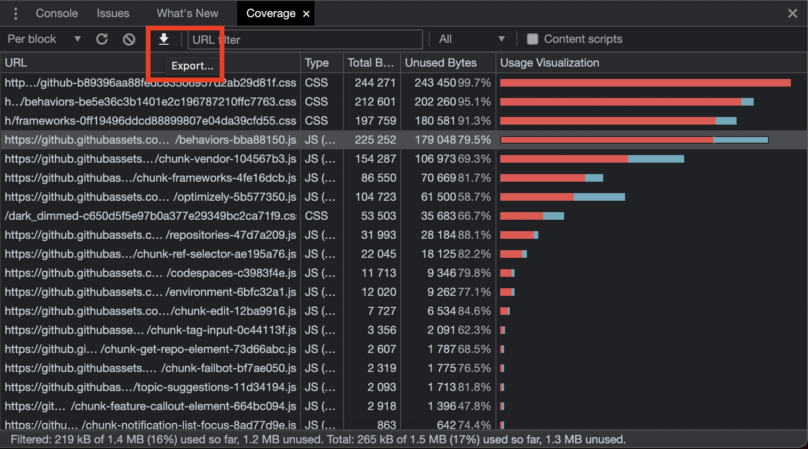

# coverage-inspector
GUI Inspector for Google Chrome's coverage report. Uses sourcemaps to link bundle's lines to their source in the project.
Based on [mozilla/source-map](https://github.com/mozilla/source-map).

## Quickstart
### 1. Install CLI
```shell
npm i -g coverage-inspector
```

### 2. Get a coverage report
Create a coverage report using Chrome's `Coverage` tab. Please follow [its documentation](https://developer.chrome.com/docs/devtools/coverage/). And export the JSON afterwards:



### 3. Parse the report
```shell
    coverage-inspector parse -i <path-to-your-report> [-n <name-to-override-default-output-filename>]
```

[Check out an example](https://htmlpreview.github.io/?https://github.com/mikhail-ev/coverage-inspector/master/examples/github/report.html) of an output generated for this page.

## Commands
### Parse
```shell
coverage-inspector parse

Parse a coverage file and generate a report

Options:
      --version                        Show version number             [boolean]
      --help                           Show help                       [boolean]
  -i, --input                          Path to a Chrome coverage report
                                                             [string] [required]
  -v, --verbosity                      Set level of verbosity
         [string] [choices: "debug", "warnings", "errors"] [default: "warnings"]
  -n, --filename                       Filename to replace automatically
                                       generated
                                       "coverage-report_${timestamp}.html"
                                                                        [string]
  -o, --output-dir                     Set output directory
                                                         [string] [default: "."]
      --search-start-in-lines, --ssil  In how many lines to search for the start
                                       if the sourcemap doesn't start with the
                                       first line of the source
                                                         [number] [default: 200]
```

## Contribution
TBD

## Roadmap
TBD
